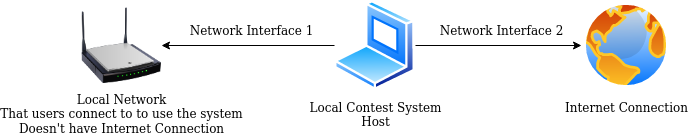
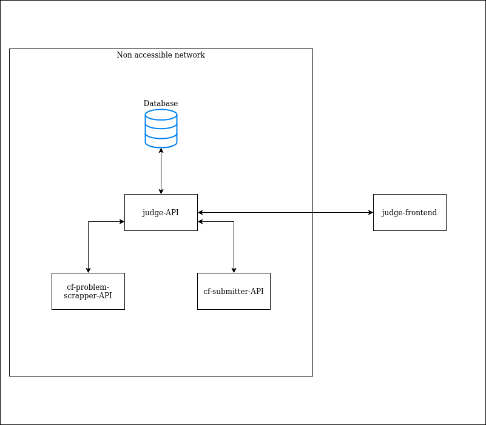

# Local Contest System

A simple local contest system that uses Codeforces as a judge. You don't need internet connection for all the users. Only the host needs to be connected to the internet. Useful in cases of lack of internet connection, or limiting users to judge system access only.

You can accomplish this by simply connecting the host with two different network interfaces, e.g., (WiFi, and Ethernet), (Ethernet, and, USB Tethering), or whatever.

## Usage

:one: - clone the repo :arrow_down:  
:two: - `docker-compose up` :whale:  
:three: - judge is working on your http://localhost :smiley:  
:four: - enjoy :tada:  

## How it works

